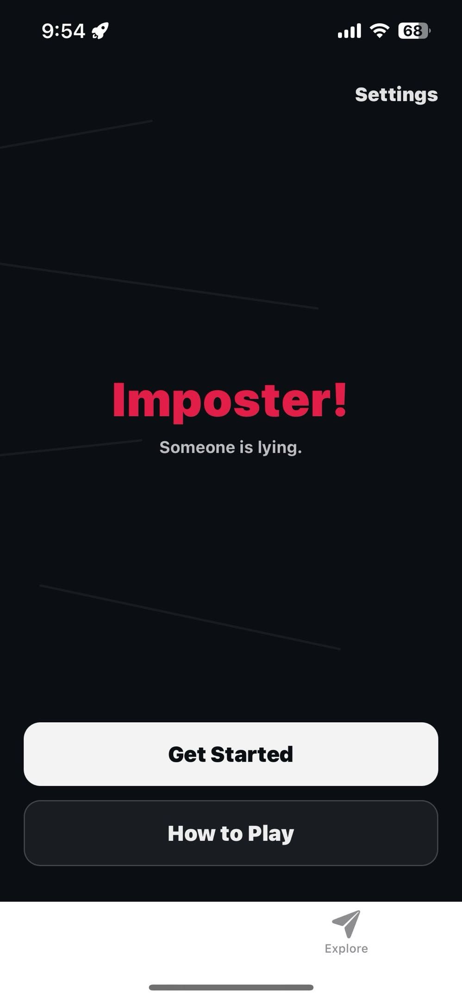
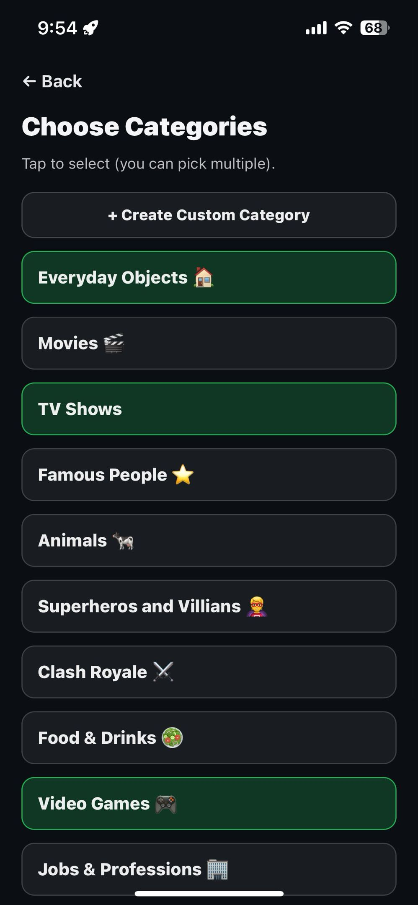
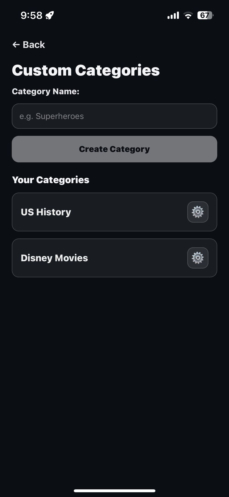
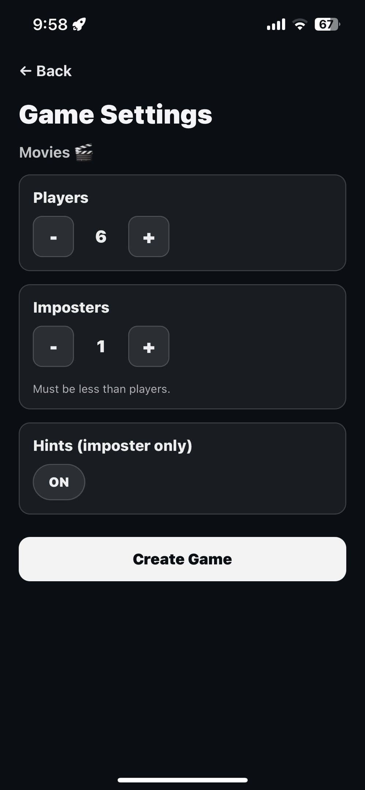
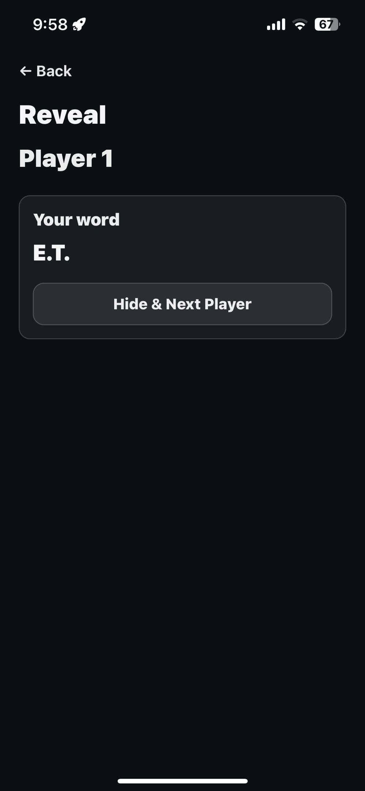
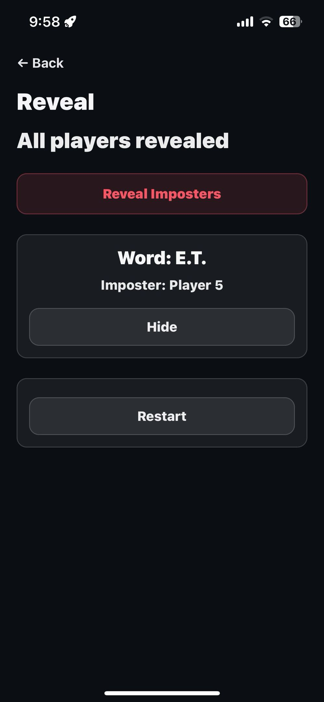

# Imposter Mobile Game

A cross-platform party game built with React Native and Expo where players receive roles and attempt to identify the imposters without revealing the shared word.

Designed as a mobile app with offline-friendly UX, and a dedicated backend API.

---

## Screenshots

## Home Screen


## Category Selection Screen


## Custom Category Editor



## Game Settings Screen


## Reveal Screen


## Reveal Screen After Reveal



## Features

- Multiplayer party gameplay with hidden roles  
- One or more imposters per round 
- Category-based word selection (built-in + custom categories)  
- Optional hints for imposters  
- Restartable games with preserved settings  
- Offline UI with cached categories  
- Runs on iOS and Android via Expo  

---

## Tech Stack

- **Frontend:** React Native, Expo, TypeScript  
- **Routing:** Expo Router 
- **Storage:** AsyncStorage  
- **Backend:** Custom Express API (see `imposter-api`)  
- **Deployment:** Expo (mobile), Fly.io (API)  

---

## Architecture Highlights

- File-based routing with Expo Router 
- Local caching of categories to reduce API calls and improve load times
- Clear separation between game setup, reveal flow, and endgame logic
- UI that handles expired or missing games
- Backend-driven game state with stateless client requests

---

## Running Locally

### Install dependencies
```bash
npm install
```

### Start the Expo dev server
```bash
npx expo start
```

You can then open the app using:
- **Expo Go** (scan QR code)
- **iOS Simulator**
- **Android Emulator**
- **Development build**

---

## Project Structure

```
app/
├─ (tabs)/                 # Tab-based navigation
├─ get-started.tsx         # Game setup flow
├─ game-settings.tsx       # Player, category, imposter settings
├─ reveal.tsx              # Player-by-player reveal screen
├─ categories.tsx          # Category selection
├─ create-category.tsx     # Custom category creation
├─ category-editor.tsx     # Edit custom categories
├─ how-to-play.tsx         # Game instructions
├─ share.tsx               # Share game info
├─ terms-of-use.tsx        # Legal
├─ privacy-policy.tsx      # Privacy policy
│
components/
├─ ui/                     # Reusable UI primitives
├─ themed-view.tsx         # Theming helpers
├─ parallax-scroll-view.tsx
│
constants/
├─ api.ts                  # API base URL
├─ theme.ts                # App theme constants
│
storage/
├─ customCategories.ts     # AsyncStorage helpers
│
types/
├─ category.ts             # Shared type definitions
```

---

## Configuration Notes
- Backend URL is centralized in `constants/api.ts`
- `node_modules`, native build folders, and env files are excluded via `.gitignore`

---

## Future Improvements

- [ ] Lobby / room codes for remote play
- [ ] Timers and round limits
- [ ] UI improvements (larger text, color contrast)
- [ ] Sound effects
- [ ] App Store / Play Store release builds

---

## Notes

- This is a mobile-first application (web support is optional)
- Designed to be played locally in groups
- Backend API is deployed separately and handles all game logic