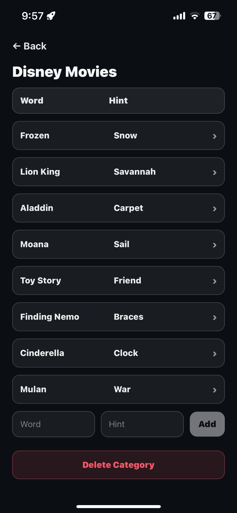

# Imposter Mobile Game

This is a small party game I built to play in person with friends. Everyone gets a role, most players see the same word, and a few players don’t. The goal is to figure out who’s bluffing without giving the word away.

The app is designed to work offline during gameplay, with a lightweight backend only used for game setup and shared state.

---

## Features

- Start a game with a group and randomly assign roles
- Supports one or more imposters per round
- Choose from built-in categories or make your own
- Give imposters optional hints
- Restart games without re-entering all settings

---

## Screenshots

## Home Screen


## Category Selection Screen


## Custom Category Editor



## Game Settings Screen


## Reveal Screen


## Reveal Screen After Reveal


---

## Tech Stack

- **Frontend:** React Native, Expo, TypeScript - For cross-platform support 
- **Routing:** Expo Router - Simple navigation
- **Storage:** AsyncStorage - Cache custom categories locally
- **Backend:** Custom Express API (see `imposter-api`) - Manage game state  
- **Deployment:** Expo (mobile), Fly.io (API) - For backend deployment

---

## Implementation Notes

- This app uses Expo Router so it's easier to iterate on the game flow as screens were added and removed
- Categories are cached locally using AsyncStorage so the game does not depend on the backend once a round starts
- Client is kept lightweight as game state lives on the backend

---

## Running Locally

### Install dependencies
```bash
npm install
```

### Start the Expo dev server
```bash
npx expo start
```

You can then open the app using:
- **Expo Go** (scan QR code)
- **iOS Simulator**
- **Android Emulator**
- **Development build**

---

## Project Structure

```
app/
  (tabs)/              # Tab navigation
  get-started.tsx      # Initial game setup
  game-settings.tsx    # Player + category config
  reveal.tsx           # Player-by-player reveal
  categories.tsx       # Category selection
  create-category.tsx  # Custom category creation
  category-editor.tsx  # Edit custom categories
  how-to-play.tsx
  share.tsx

components/
  ui/                  # Reusable UI pieces
  themed-view.tsx
  parallax-scroll-view.tsx

storage/
  customCategories.ts  # AsyncStorage helpers

constants/
  api.ts               # Backend URL
  theme.ts

types/
  category.ts

```

---

## Configuration Notes
- Backend URL is centralized in `constants/api.ts`
- `node_modules`, native build folders, and env files are excluded via `.gitignore`

---

## Future Improvements

- Lobby / room codes for remote play
- Timers and round limits
- UI improvements (larger text, color contrast)
- Sound effects
- App Store / Play Store release builds

---